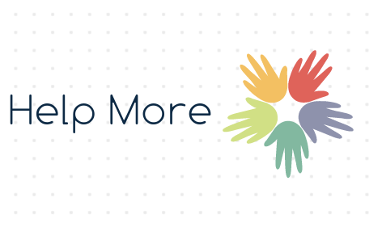
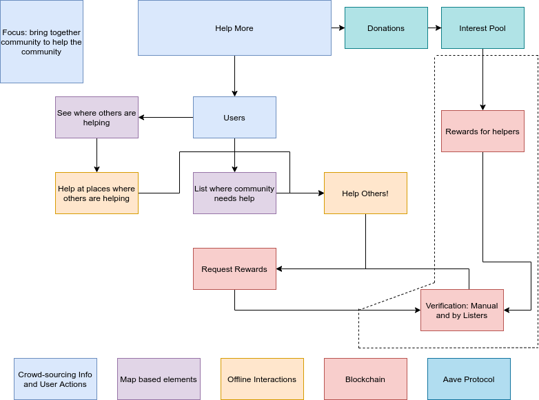

# Help More

## Description

Doing community work is a great way to give back to others. People across the world are always doing community work such as cleaning parks, helping the elderly in their free time. However many people are still hesitant to do community work. Also, there are many people who want to help the community by listing tasks, but they do not find a proper platform. Some are not motivated enough to help others/the community. Also, we have seen that there are philanthropists who care about the community and donate for the welfare of the community, but that donation is not always used in a proper way. 

Help more solve all these issues. It’s a platform where users can add community tasks, perform tasks, and ask for help. To motivate the user, we have a reward system i.e. after completing tasks, users can claim aDai tokens as a reward. Philanthropists can donate aDai tokens. After a minimum of 4-5 months, they can claim back all their funds if they want. So you might wonder, how we will get money to reward? Using Aave, we are creating a lending pool where we get cumulative interest every hour. For example, if someone donates 5000 aDai tokens, then after 4-5 months we may have 5500 aDai tokens (interest varies every hour as per blockchain market).

We have three main stakeholders which can do the activities : 

User
- List down community/help needed tasks with proper location
- Able to see all tasks in a map with locations
- Perform the community task
- Ask for reward

Philanthropist
- Convert Dai to aave Dai(aDai) tokens
- Donate aDai tokens to Help More Organization
- Convert aDai to Dai
- Withdraw the amount back

Admin
- Review user’s reward request and accept/decline
- Review withdraw request and accept/decline

IMPACT: By using this platform, it’s a win-win situation for everyone. Users will be able to get the motivation to help society as well as get the money. Philanthropists would be able to withdraw back their funds if they want, but they have already helped the community with their funds. 

## Tech Stack used 

Node.JS, React.JS, MongoDB, Web3, AAVE, Google Maps API, Radar.io

You need to have a metamask account and some test ethereum on Kovan Network. 

## System Design : 

## Backend

Libraries and dependencies
- Express
- MongoClient
- JsonWebTokens
- Bcrypt
- CORS

Installation steps
- Be sure that you are in `/help-more/backend` path
- Run `npm i`
- Make sure that MongoDB is installed and running
- Run `npm start server` 

## Frontend

Libraries and dependencies
- Material UI
- Axios
- Google maps react
- Web3

Installation steps
- Be sure that you are in `/help-more/frontend/help-more` path
- Run `npm i`
- Run `npm start` 

## Team Members
- [Nisarg Shah](https://github.com/nisarg1499)
- [Kaushal Patil](https://github.com/Kaushal1011)
